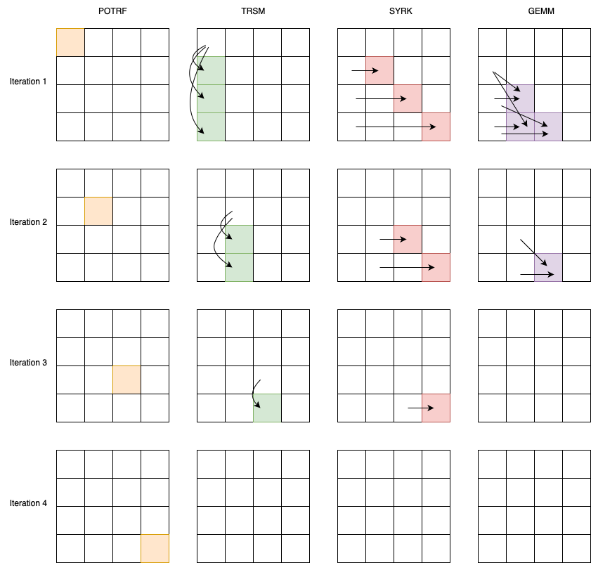

Tiled Cholesky Decomposition
============================================================

Given a Hermitian positive-definite matrix :math:`A`, Cholesky decomposition finds :math:`L` such that

.. math::

   A = L * L^{T}

Where :math:`L` is a lower triangular matrix with real and positive diagonal entries and :math:`L^{T}` is the conjugate transpose of :math:`L`. To find decomposition we can divide the matrix into tiles and operation on some tiles will depend on another opeartion on aother tile. This will create *happens-before* relationship between the tiles. Due to this relation Tiled Cholesky Decomposition algorithm is a good candidate for task-based algorithm.
