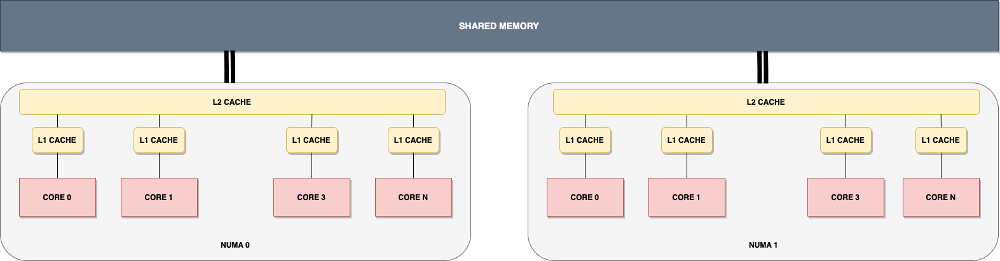
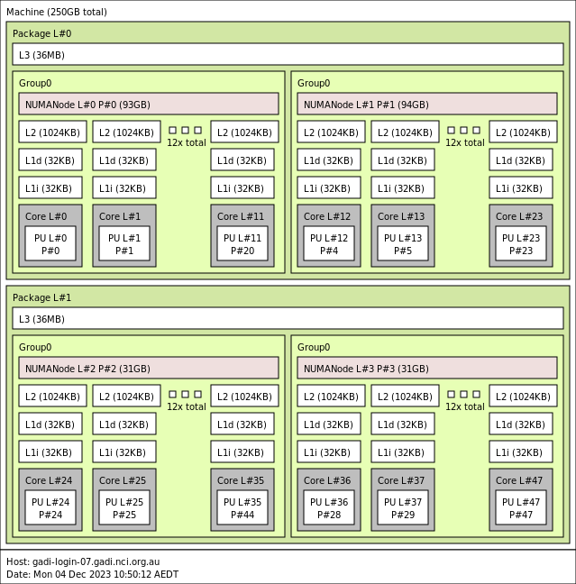
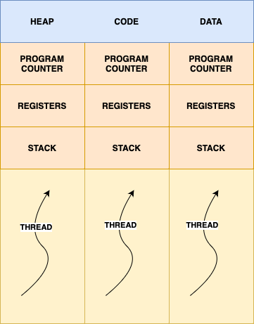
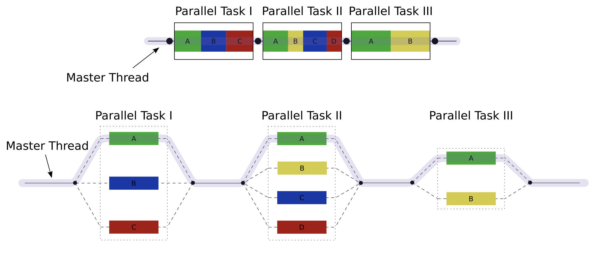

Parallel Programming with OpenMP
============================================================

This tutorial demonstrates how we can use OpenMP for shared memory programming.

Learning outcomes of the tutorial are:

1. Learn how to program for shared memory using OpenMP.
2. Learn how to use tasks in OpenMP.

Prerequisite:

1. Experience with C Programming.

Shared Memory
------------------------------------------------------------

In a shared memory system, multiple CPUs are organized into distinct regions known as NUMA regions. Each of these regions exhibits varying affinities towards specific portions of memory, and multiple CPUs can be present within each NUMA region. The provided diagram illustrates two NUMA regions, each with a single CPU. These CPUs possess multiple cores, each capable of independently executing arithmetic and logic operations. Furthermore, each core maintains its own L1 cache, and depending on the system's architecture, all cores in a NUMA region may share an L2 cache, while NUMA regions may share an L3 cache. The diagram in question depicts only L1 and L2 caches.

When running a sequential program, we utilize just one core from one of the NUMA regions. However, the program's performance can be significantly enhanced if it can distribute concurrent tasks to different cores.

You can use the command ``lstopo`` to find the architecture of your machine. ``lstopo`` on Gadi login nodes will give you the following:

Threads
------------------------------------------------------------

A thread is a sequential independent execution stream that executes different tasks in order. Typically, a thread is a constituent component of a process, and a single process can have multiple threads. Each thread maintains its own program counter, stack memory, and registers. Nevertheless, threads within the same process share the heap memory and it can potentially share the same code and data.

Each process has an upper bound on the number of threads it can handle. This number can be found using the command:

::

   cat /proc/sys/kernel/threads-max

The operating system assigns a thread to a core, allowing the thread to utilize the core's ALU for instruction execution. At any moment, only one thread can access a particular ALU within a core. Consequently, when the number of threads assigned to a core exceeds the core's available ALUs, the OS performs ``context switching``, cycling between the various threads allocated to that core. Typically, in high-performance computing (HPC), it is customary to launch a number of threads equal to the number of available cores, thereby ensuring minimal context switching.

Fork-Join Parallelism
------------------------------------------------------------

The fork-join method is a parallel computing technique in which the program's execution branches or ``forks`` at specific points and later converges or ``joins`` at subsequent points. In the fork phase, individual threads execute parallel segments of the program that can be processed simultaneously. In the join phase, the program resumes its execution in a sequential manner, much like a traditional sequential program. OpenMP follows the fork-join model of paralleism.

Sample Application
------------------------------------------------------------

In this tutorial we will be mainly using 3 applications to demonstrate the different aspcts of OpenMP:

* Calculating the :doc:`value of π <applications/pi>` using monte carlo method.
* Finding :doc:`Mandelbrot <applications/mandelbrot>` fractal by Monte Carlo sampling.
* Tiled :doc:`Cholesky Factorization <applications/cholesky>`.

The Performance Application Programming Interface (PAPI)
------------------------------------------------------------

The Performance Application Programming Interface (PAPI) provides an interface and methodology for collecting performance counter information from various hardware and software components. In this tutorial, we will be using PAPI in some of the programs.

In this tutorial, we will be using PAPI v5.7.0 in some of our programs and the program ``papi.c`` (in the ``src/`` directory) demonstrates how we can use the PAPI API.

OpenMP API
------------------------------------------------------------

The OpenMP Application Program Interface (API) is a portable, scalable model that gives shared-memory parallel programmers a simple and flexible interface for developing parallel applications. The OpenMP standard supports multi-platform shared-memory parallel programming in C/C++ and Fortran. It is jointly defined by a group of major computer hardware and software vendors and major parallel computing user facilities. For more information, see the `OpenMP website <http://www.openmp.org>`_.

OpenMP consists of a set of program directives and a small number of function/subroutine calls. The function/subroutine calls are associated with the execution runtime environment, memory locking, and timing. The directives are primarily responsible for the parallelization of the code. For C/C++ code, the directives take the form of *pragmas*:

``#pragma omp``

A program written using OpenMP directives begins execution as a single process, or "master thread". A single thread executes sequentially until it encounters the first parallel construct. When this happens, a team of threads is created, and the original thread assumes the role of master. Upon completion of the parallel construct, the threads synchronize (unless specified otherwise), and only the master continues execution. Any number of parallel constructs may be specified in the program, and as a result, the program may "fork" and "join" many times.

The number of threads that are spawned may be:

* explicitly given as part of the pragma;
* set using one of the OpenMP function calls; or
* predefined by an environment variable or a system setup default.

We note that the number of threads may exceed the number of physical cores (CPUs) on the machine; this is known as *over-subscription*. When over-subscription occurs, it is up to the operating system to schedule the threads as best it can among available cores. Even if the user requests a high thread count, the OpenMP runtime will generally avoid over-subscription, as it can reduce performance. This behaviour is controlled by the ``OMP_DYNAMIC`` environment variable (default ``true``), allowing the runtime to "adjust the number of threads to use for executing parallel regions to optimize the use of system resources". Setting ``OMP_DYNAMIC=false`` disables this behaviour, requiring OpenMP to spawn the requested number of threads.
