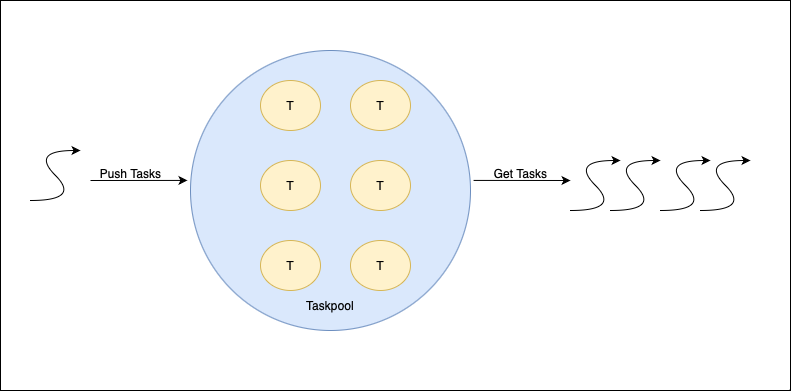
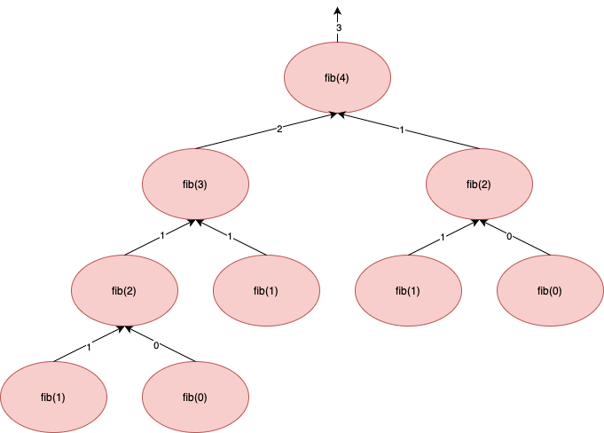
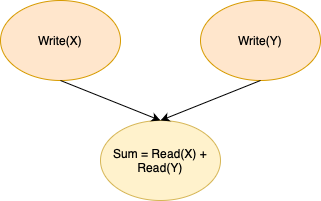
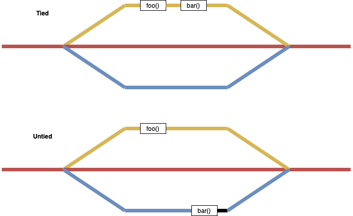

Task-based Computing in OpenMP
============================================================

The ``tasks`` Construct
------------------------------------------------------------

Tasks in OpenMP is composed of a code segment and the data to be operated on, along with the location where the execution will happen. When a thread encounters a task construct, it can choose to execute the task immediately or defer its execution until a later time. If deferred, the task in placed in a task pool. The threads in the parellel section can remove the tasks from the task pool and execute them until the pool is empty.

.. code-block:: c

   int fib(int n)
   {
       if (n < 2) return n;

       #pragma omp task shared(l) firstprivate(n)
       l = fib(n-1);

       #pragma omp task shared(r) firstprivate(n)
       r = fib(n-2);

       #pragma omp taskwait
       return l+r;
   }

The code block immediatly after ``task`` construct will be the code a task will execute. The ``#pragma omp taskwait`` construct specifies a wait on the completion of child tasks of the current task.

22. The program ``openmp_tasks.c`` demonstrates how you can use the ``task`` construct.

The ``depend`` Construct
------------------------------------------------------------

The ``depend`` clause allows you to provide information on the how a task will access data. This also allows to define additional constraints on tasks.

Some examples of use for the depend clause:

1. ``depend(in: x, y)``: the task will read variables x and y.
2. ``depend(out: x)``: the task will write variable x.
3. ``depend(inout: x, buffer[0:n])``: the task will both read and write variable x and the content of n elements of buffer starting from index 0.

The ``depends`` clause allows the programmer to create a *happens-before* relation between tasks. For instance the code segment given below will make sure that the tasks that caclculate the value of ``z`` is executed only after the tasks that write to ``x`` and ``y`` is complete.

.. code-block:: c

   #pragma omp task shared(x) depend(out: x)
   write_val(&x, 10);

   #pragma omp task shared(x) depend(out: y)
   write_val(&y, 10);

   #pragma omp task shared(x, y) depend(in: x, y)
   z = read_val(&x) + read_val(&y);

One of the main advanatge of ``depends`` clause is that it removes the need of the ``taskwait`` clause.

23. The program ``openmp_depend.c`` demonstrates how you can use the ``depends`` construct.

The ``untied`` Construct
------------------------------------------------------------

A task is tied if the code is executed by the same thread from beginning to end. Otherwise, the task is untied and the code can be executed by more than one thread. By default the tasks are tied in OpenMP, but this can result in performance issues.

.. code-block:: c

   #pragma omp task untied
   {
       foo();
       #pragma omp taskyield
       bar();
   }

The ``taskyield`` construct specifies that the current task can be suspended in favor of execution of a different task.

24. The program ``openmp_tied.c`` demonstrates how you can use the ``untied`` and ``taskyield`` construct.

The ``taskloop`` Construct
------------------------------------------------------------

The taskloop construct is used to specify that the iterations of a loops are executed in parallel using OpenMP tasks. The iterations are distributed across tasks that are created by the construct and scheduled to be executed.

.. code-block:: c

   #pragma omp taskloop num_tasks(20)
   for (i = 0; i < N; i++) {
       arr[i] = i * i;
   }

25. The program ``openmp_taskloop.c`` demonstrates how you can use the ``taskloop`` construct.
26. What difference do you see when you change the number of element and the number of tasks?

The ``taskgroup`` Construct
------------------------------------------------------------

.. code-block:: c

   #pragma omp taskgroup
   {
       #pragma omp task
       {
           #pragma omp task
           printf("Child task \n");

           printf("Parent task \n");
       }
   }

The ``taskwait`` construct dictates that the current task region remains suspended until the child tasks of the current task are completed. However, it does not indicate suspension until the descendants of the child tasks are finished. To synchronize tasks and their descendant tasks, you can enclose them within a ``taskgroup`` construct.

27. The program ``openmp_taskgroups.c`` demonstrates how you can use the ``taskgroup`` construct.

Exercise 5
------------------------------------------------------------

28. The program ``exercise5.c`` implements the :doc:`Cholesky Factorization <applications/cholesky>` without any parallelization. Paralleize the program using different OpenMP task directives. The solution is available in ``exercise5_solution.c``.

    You can run the executable using

    ::

       ./exercise5  N

    where ``N`` is the Matrix dimension.

Contributers
------------------------------------------------------------

This course is based on material developed by current and former ANU staff, including `Peter Strazdins <https://cecc.anu.edu.au/people/peter-strazdins>`_, `Alistair Rendell <https://www.flinders.edu.au/people/alistair.rendell>`_, `Josh Milthorpe <http://www.milthorpe.org>`_, `Joseph John <http://josephjohn.org>`_ and `Fred Fung <https://nci.org.au/research/people/fred-fung>`_.
